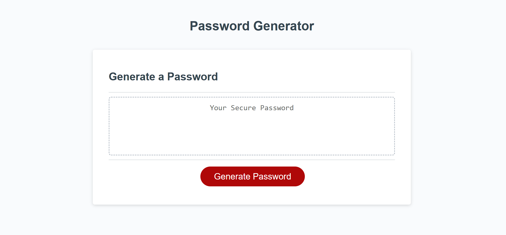

# Unique-Password-Generator

## Description
This is a helpful password generator that creates a password for the user rather than having to come up with one.

## Table of Contents

- [Installation](#installation)
- [Usage](#usage)
- [Credits](#credits)
- [License](#license)

## Installation

Not necessary

## Usage
Press the generate button, choose the length you want the password to be, and then choose what types of characters you want to be in the password.

website: https://wnicoles.github.io/Unique-Password-Generator/

## Credits

Starter code from Xandromus's friendly-parakeet.

## License
MIT License
