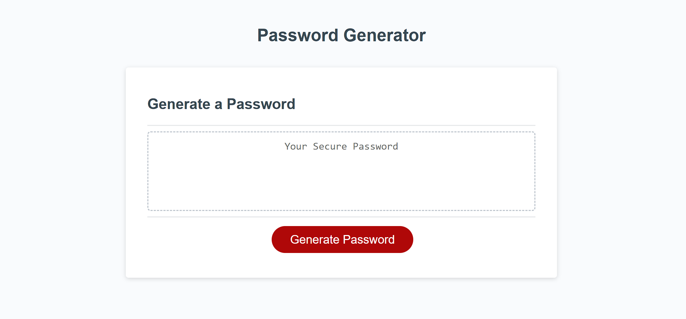

# Unique-Password-Generator

## Description
This is a helpful password generator that creates a password for the user rather than having to come up with one.

## Table of Contents

- [Installation](#installation)
- [Usage](#usage)
- [Credits](#credits)
- [License](#license)

## Installation

Not necessary

## Usage
To generate a password click on the "generate button". When prompted, choose the length you would like your password to be. Then choose whether or not you would like to add upper case letters, lower case letters, numbers, and special characters. Your unique password will then appear.

website: https://wnicoles.github.io/Unique-Password-Generator/

## Credits

Starter code from Xandromus's friendly-parakeet.

## License
MIT License
